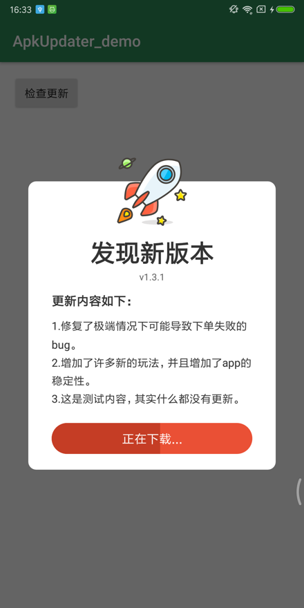
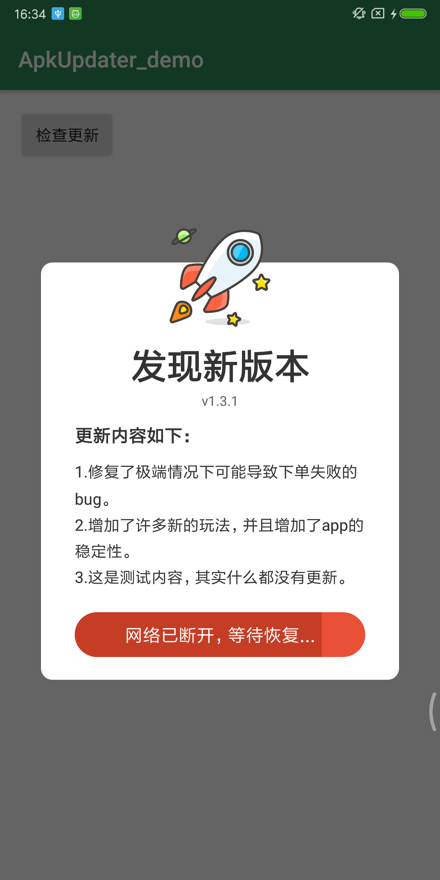
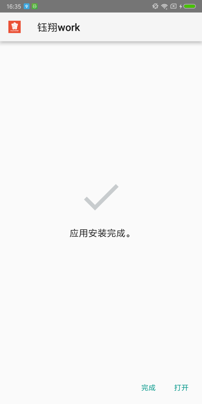

# ApkUpdater  [](https://jitpack.io/#kelinZhou/ApkUpdater)

基于DownLoadManager实现安装包更新，安装包缓存，支持MD5校验，支持断点续传，自定义UI，提供了默认UI。

## 演示

按照惯例还是先上图吧。






## 更新

### 3.2.1 重构及优化。
-- 优化以及重构部分代码逻辑
-- 提高稳定性以及健壮性
-- 对默认UI中的提示文字进行英语适配

### 3.1.2 优化当前App版本的获取方式，防止AppInfo获取失败导致获取当前App版本号错误的Bug。

### 3.1.1 修复IllegalCallException: No Activity is currently started！的问题。

### 3.1.0 优化升级逻辑，增加弱更新功能。

1. UpdateInfo接口移除了isForceUpdate的属性，改为updateType属性，其类型为```UpdateType```。```UpdateType```为枚举类型，共有以下3个类型：
    * ```UpdateType.UPDATE_WEAK``` 弱更新，当更新类型为该类型时将会在默认的弹窗中出现`忽略此版本`的按钮，点击后默认会调用```ApkUpdater.skipThisVersion()```方法，
      即表示直到下一个版本出现前不会再次自动提示。如果用户还想更新则可以通过手动更新的方式更新应用。设置手动更新的方式可参考```ApkUpdater.check()```方法。
    * ```UpdateType.UPDATE_NORMAL```普通更新。
    * ```UpdateType.UPDATE_FORCE```强制更新。
2. DefaultUpdateDialog中的```onUpdateButtonClick()```方法名变更为```onUpgradingInTheBackground()```。
3. 判断是否是强制更新的逻辑发生了变化，只要应用当前的版本号包含在UpdateInfo中的forceUpdateVersionCodes字段中就会认为是强制更新，及updateType为```UpdateType.UPDATE_FORCE```，而忽略updateType原来的值。

### 3.0.4 修复Manifest merger时可能会出现label冲突的问题。

### 3.0.3 修复FragmentDialog在dismiss时可以引发崩溃的Bug。

### 3.0.2 修复在OPPO手机上总是提示安装包已损坏的问题。

在安装更新时OPPO手机总是提示包已损坏(其实并没有损坏)，主要是因为在startActivity之后调用了```Process.killProcess(Process.myPid())```这行代码所导致的。现已将这行代码删除。

### 3.0.1 将DefaultUpdateDialog改为open(可以被继承)。

将DefaultUpdateDialog改为open(可以被继承)，这将使得自定义弹窗更加容易，你可以直接继承DefaultUpdateDialog来自定义你的弹窗。

### 3.0.0 基于Kotlin和Androidx重构

1. 基于Kotlin语言进行重构并迁移至Androidx。没有迁移至Androidx的小伙伴请使用之前的版本。
2. 优化升级弹窗的逻辑，使得自定义弹窗更加容易。

### 2.2.3及以前

基于Java、Support库开发，可自定义弹窗、支持完整性校验、自动缓存。

## 下载

#### 第一步：添加 JitPack 仓库到你项目根目录的 gradle 文件中。

```groovy
allprojects {
    repositories {
        //省略部分代码...
        maven { url 'https://jitpack.io' }
    }
}
```

#### 第二步：添加这个依赖。

```groovy
dependencies {
    implementation 'com.github.kelinZhou:ApkUpdater:${Last version here!}'
}
```

## 使用

#### 第一步：添加权限

你需要在你的清单文件中添加以下权限：

```html
    <!--网络访问权限-->
<uses-permission android:name="android.permission.INTERNET"/>
<!--不弹出通知栏权限-->
<uses-permission android:name="android.permission.DOWNLOAD_WITHOUT_NOTIFICATION"/>
<!--DownloadManager-->
<uses-permission android:name="android.permission.ACCESS_DOWNLOAD_MANAGER"/>
<!--获取网络状态权限-->
<uses-permission android:name="android.permission.ACCESS_NETWORK_STATE"/>
<!--APK安装权限-->
<uses-permission android:name="android.permission.REQUEST_INSTALL_PACKAGES"/>
```

#### 第二步：清单文件配置

你需要在你清单文件中的**Application**节点下添加如下配置：

```html
<!--Android7.0一上安装Apk所需要的文件提供者-->
<provider
        android:name="androidx.core.content.FileProvider"
        android:authorities="${applicationId}.fileProvider"
        android:exported="false"
        android:grantUriPermissions="true">
    <meta-data
            android:name="android.support.FILE_PROVIDER_PATHS"
            android:resource="@xml/apk_updater_file_paths"/>
</provider>

<!--版本更新服务-->
<service android:name="com.kelin.apkUpdater.DownloadService"/>
```

provider标签中```android:authorities```的值可以自定义，需要在初始化```ApkUpdater.init(context,fileProvider)```方法中传入该值。

在Android7.0以上的设备如果不能正常下载你可能还需要在清单文件的Application节点下增加networkSecurityConfig配置。例如：

```html

<application
        android:name=".App"
        android:networkSecurityConfig="@xml/network_security_config">

    <!--此处省略了你的Activity、Service等四大组件-->

</application>
```

其中 network_security_config 文件需要定义在res的xml文件夹下，它的代码如下:

```html
<?xml version="1.0" encoding="utf-8"?>
<network-security-config>
    <base-config cleartextTrafficPermitted="true">
        <trust-anchors>
            <certificates src="system"/>
        </trust-anchors>
    </base-config>
</network-security-config>
```

#### 第三步：初始化

你需要在Application的onCreate方法中调用``` ApkUpdater.init(context, fileProvider) ```初始化ApkUpdater。例如:

```kotlin
class App : Application() {
    override fun onCreate() {
        super.onCreate()
        ApkUpdater.init(this, "$packageName.fileProvider")
    }
}
```

**注意:** 别忘记在清单文件中使用你的Application:

```html

<application
        android:name=".App"  //这里是你自定义的Application。
android:allowBackup="true"
android:icon="@mipmap/ic_launcher"
android:label="@string/app_name"
android:supportsRtl="true"
android:theme="@style/AppTheme">

<!--此处省略了你的Activity、Service等四大组件-->

</application>
```

#### 第五步：检测更新

首先利用你项目的网络访问能力从服务器端获取更新信息并转换为**javaBean**对象，然后让这个对象实现**UpdateInfo**接口。下面是这个接口中所有方法：

```kotlin
ApkUpdater.Builder().create().check(
    UpdateInfoImpl(
        "http://test-cloud-yxholding-com.oss-cn-shanghai.aliyuncs.com/yx-logistics/file/file/20200703/1593709201374.apk", //安装包下载地址
        131, //网络上的版本号，用于判断是否可以更新(是否大于本地版本号)。
        "v1.3.1", //版本名称，用于显示在弹窗中，以告知用户将要更到哪个版本。
        false,  //是否是强制更新，如果干参数为true则用户没有进行更新就不能继续使用App。(当旧版本存在严重的Bug时或新功能不与旧版兼容时使用)
        "更新内容如下：",  //升级弹窗的标题。
        "1.修复了极端情况下可能导致下单失败的bug。\n2.增加了许多新的玩法，并且增加了app的稳定性。 \n3.这是测试内容，其实什么都没有更新。", //升级弹窗的消息内容，用于告知用户本次更新的内容。
        SignatureType.MD5, //安装包完整性校验开启，并使用MD5进行校验，如果不想开启，传null。(目前只支持MD5和SHA1)
        ""  //完成性校验的具体值，返回空或null则不会进行校验。
    )
)
```

## 其他

#### 构建**Updater**对象

| 方法名                                                                           | 说明                  |
|-------------------------------------------------------------------------------|---------------------|
| ```setCallback(callback: IUpdateCallback?)```                                 | 设置监听对象。             |
| ```setDialogGenerator(generator: (updater: ApkUpdater) -> ApkUpdateDialog)``` | 使用自定义弹窗。            |
| ```create()```                                                                | 完成**Updater**对象的构建。 |

#### 自定义Dialog

```kotlin
ApkUpdater.Builder()
    .setDialogGenerator {
        MyUpdateDialog(it)
    }.create()
```

MyUpdateDialog 是ApkUpdateDialog接口的实现类,也可以直接继承DefaultUpdateDialog。ApkUpdateDialog接口中都有注释，写的应该还算比较详细的，这里就不在讲了。

#### 检查更新

检查更新的代码如下：

```kotlin
apkUpdater.check(updateInfo)
```

#### 安装APK

安装是不许要你关心的，下载完成后会自动进入安装页面。除非你禁用了自动安装，或是想安装一个现有的Apk。如果是这样的话你可以使用**UpdateHelper**的```fun installApk(context: Context, apkFile: File?): Boolean```方法。

#### 其他

该项目中提供了两个工具类：UpdateHelper 和 NetWorkStateUtil。

* * *

### License

```
Copyright 2016 kelin410@163.com

Licensed under the Apache License, Version 2.0 (the "License");
you may not use this file except in compliance with the License.
You may obtain a copy of the License at

    http://www.apache.org/licenses/LICENSE-2.0

Unless required by applicable law or agreed to in writing, software
distributed under the License is distributed on an "AS IS" BASIS,
WITHOUT WARRANTIES OR CONDITIONS OF ANY KIND, either express or implied.
See the License for the specific language governing permissions and
limitations under the License.
```
